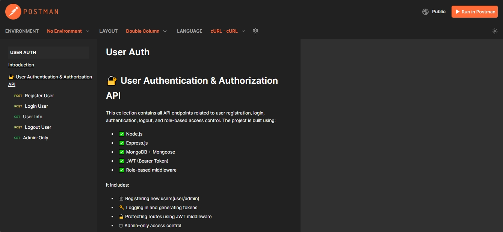

# 🔐 User Authentication & Authorization API with Bearer Token

A simple and secure **Node.js** REST API built with **Express.js**, **Mongoose**, and **JWT** to handle user registration, login, logout, and role-based control (admin & user).  🛡

---

## 🚀 Features

- 👥 User Registration & Login
- 🔐 **JWT**-based Authentication
- 🧂 Password Hashing using **Bcrypt**
- 👮‍♂️ Role-Based Access Control (`user`, `admin`)
- 🔏 Protected Routes using **Middleware**
- 📃 User Info Retrieval via Token
- 🚪 Logout with Token Handling
- ✅ Proper Error Handling and Input Validation
- 📬 Fully Tested with Postman (with sample requests/responses)
- 📄 Clean, Commented, and Readable Code

---

## 🛠 Tech Stack

- ⚙ **Node.js**
- 🚂 **Express.js**
- 🗃 **MongoDB** with **Mongoose**
- 🧂 **Bcrypt** (for password hashing)
- 🔐 **JWT (JSON Web Token)** for authentication
- 📫 **Postman** for API testing
- 🗺 **MongoDB Compass / Atlas** for DB monitoring

---

## 📫 API Endpoints

| Method | Endpoint                 | Description                      | Access      | Middleware Used            |
|--------|--------------------------|----------------------------------|-------------|-----------------------------|
| POST   | /api/users/register      | Register a new user              | Public      | –                           |
| POST   | /api/users/login         | Login user and get JWT           | Public      | –                           |
| GET    | /api/users/me            | Get current user info            | Protected   | verifyToken                 |
| POST   | /api/users/logout        | Logout the logged-in user        | Protected   | verifyToken                 |
| GET    | /api/users/admin-data    | Access data for admin only       | Admin Only  | verifyToken, adminOnly      |
    
---

<!-- ## 📸 Screenshot

 -->

---
<!-- 
## 🧪 API Testing Documentation

Use **Postman** to test all the API endpoints. You can access the full documentation here:

🔗 [Postman Collection] (https://documenter.getpostman.com/view/45958415/2sB2xBEAMd) -->